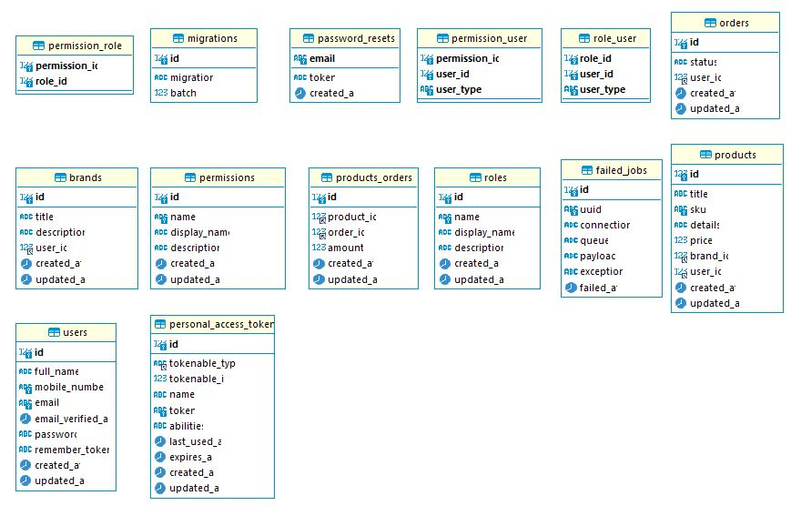

<p align="center"></p>
# Blogs
This website made for multiple bloggers, it is built with PHP Laravel, and VueJs (SPA web application)
# How to install
first git clone of the repo then intiate a database (MySql preferred) with name "blogs" then run the following commands
```
composer install
```
```
cat .env.example > .env
```
```
php artisan key:generate
```
don't forget to set the database on your machine and customize its vars in the .env file
```
php artisan migrate --seed
```
```
npm install && npm run dev
```
```
php artisan serve
```
and open this url on your browser `127.0.0.1:8000`